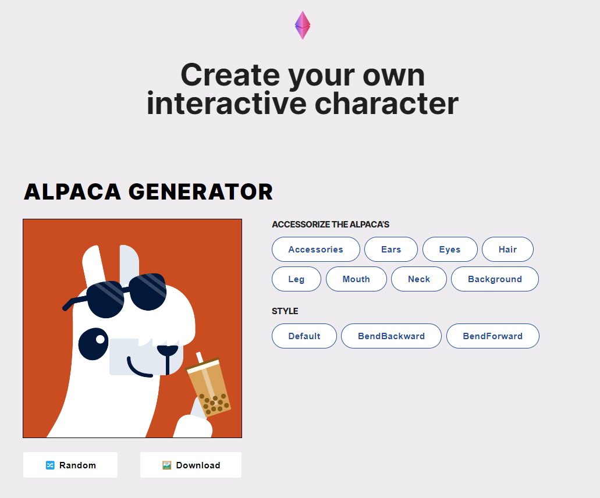

# Lama Customizator

Lama Customizator este o aplicație web simplă și interactivă care permite utilizatorilor să-și personalizeze propriul caracter în formă de lamă. Utilizatorii pot modifica diverse aspecte ale lamei, cum ar fi culoarea blănii, accesoriile (pălării, ochelari etc.), și expresiile faciale. La final, imaginea personalizată a lamei poate fi descărcată și utilizată ca imagine de profil pe orice rețea socială.

